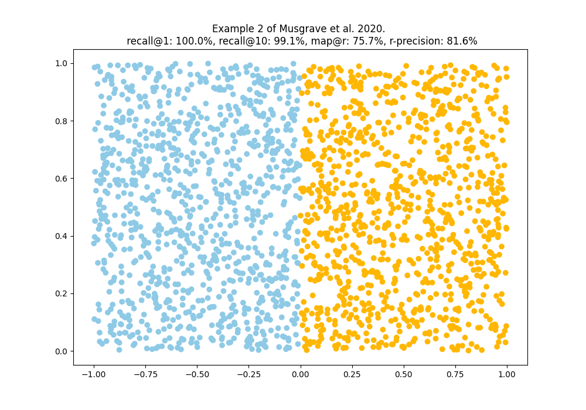
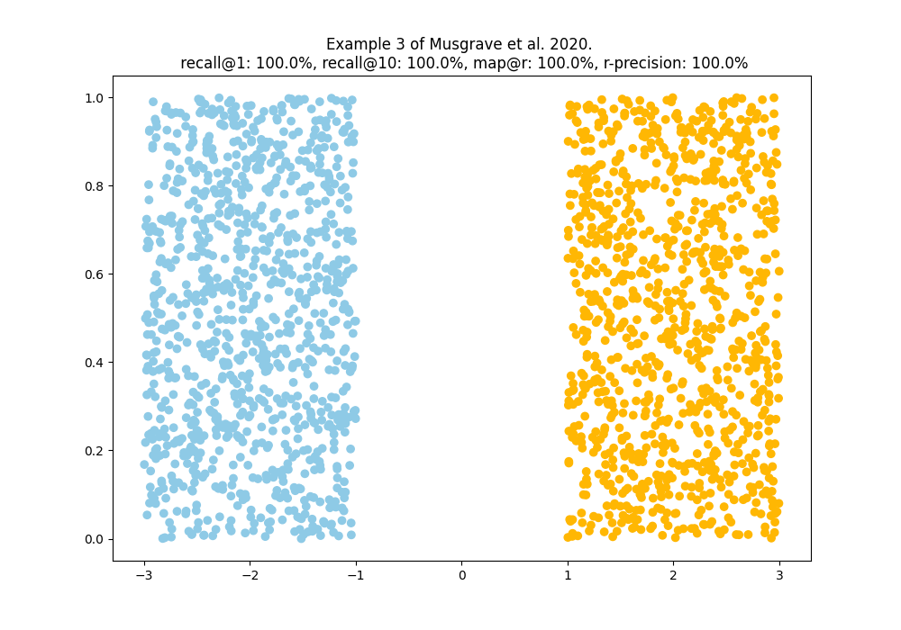

# ranking-metrics

> A repository to understand ranking metrics as described by Musgrave et al. (2020).

This implementation is not the a very fast one, but imho nice to read for 
understanding what's going on. Anyhow improvements are very welcome.

Resources used:
* [faiss getting started guide](https://github.com/facebookresearch/faiss/wiki/Getting-started)

The papers basics:

$R-Precision = \frac{r}{R}$, where R is the number of nearest neighbor embeddings for a query
and r is the number of embeddings actually corresponding to the queries class.

$$ MAP@R = \frac{1}{R} \sum_{i=1}^{R}{P(i)},\ where\ P(i) = \begin{cases} precision\ at\ i, & if\ the\ ith\ retrieval\ is\ correct \\
 0, & \text{otherwise} \end{cases} $$

The following examples replicate the toy example of Musgrave et al. in 
[*A Metric Learning Reality Check*](https://arxiv.org/abs/2003.08505). 
Plots are generated by running the tests in 
[test_reality_check.py](tests/test_reality_check.py). Examples show how **MAP@R** 
is rewarding well clusterd embedding spaces. 

The code for calculating the metrics can be found in 
[embed_metrics.py](src/ranking_metrics/embed_metrics.py) and thanks to faiss it's 
just a 100 lines. Faiss takes care of finding the nearest neighbors for a query.

## Professional implementations 

* [powerful-benchmarker](https://github.com/KevinMusgrave/powerful-benchmarker)
* [pytorch-metric-learning](https://github.com/KevinMusgrave/pytorch-metric-learning)
* [probabilistic-embeddings](https://github.com/tinkoff-ai/probabilistic-embeddings/tree/main/src/probabilistic_embeddings/metrics)
