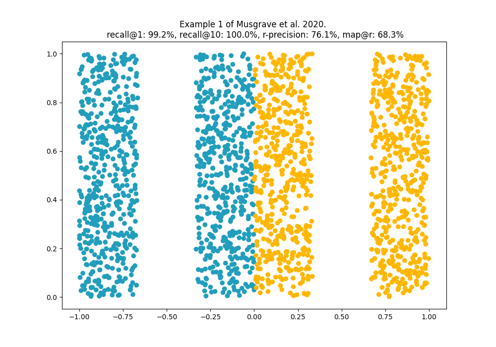
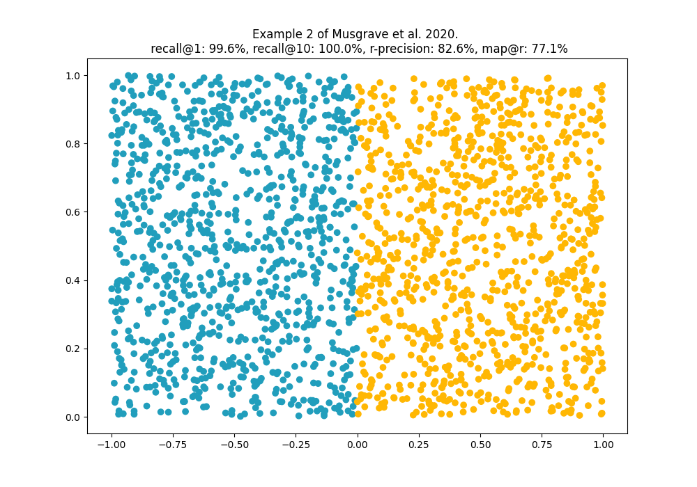
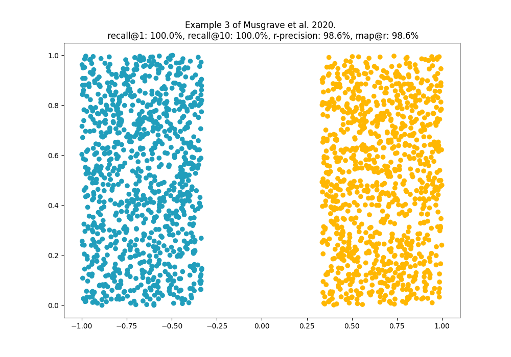
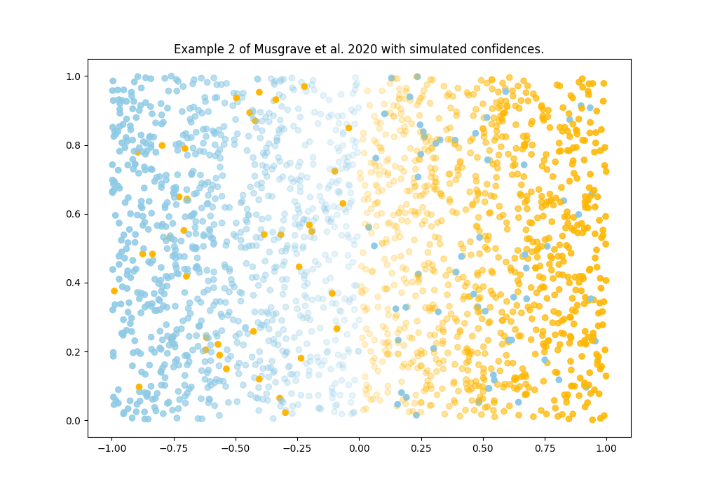
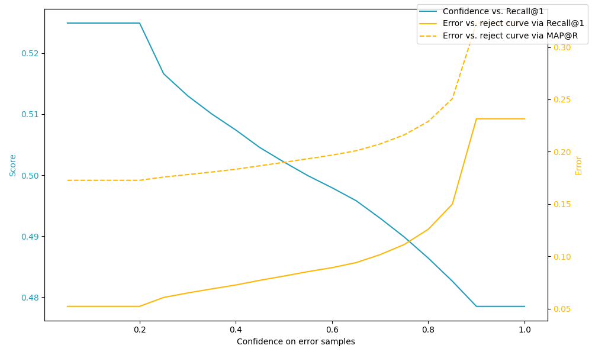

# ranking-metrics

> A repository to understand ranking metrics as described by Musgrave et al. (2020).

Resources used:
* [faiss getting started guide](https://github.com/facebookresearch/faiss/wiki/Getting-started)
* [probabilistic-embeddings](https://github.com/tinkoff-ai/probabilistic-embeddings)

## Basics metrics

$R-Precision = \frac{r}{R}$, where R is the number of nearest neighbor embeddings for a query
and r is the number of embeddings actually corresponding to the queries class.

$$ MAP@R = \frac{1}{R} \sum_{i=1}^{R}{P(i)},\ where\ P(i) = \begin{cases} precision\ at\ i, & if\ the\ ith\ retrieval\ is\ correct \\
 0, & \text{otherwise} \end{cases} $$

Other ranking metrics are described in 
[Assessing ranking metrics in top-N recommendation](https://link.springer.com/article/10.1007/s10791-020-09377-x),
by Valcarce et al. (2020). These are largely not used but give a good introduction into established metrics for
ranking metrics. In this repository we only use *recall@k*, since it is useful for combinations with confidence
values, like *ERC* (Error vs. Reject Curve). Professional researchers additionally use *MAP@R* in 
combination with *ERC*.

$$ Recall@k = \frac{|L_{k}\cap R|}{R} \\ L_{k} = List\ of\ top\ k,\ R=Recommendation $$

The following examples replicate the toy example of Musgrave et al. in 
[*A Metric Learning Reality Check*](https://arxiv.org/abs/2003.08505). 
Plots are generated by running the tests in 
[test_reality_check.py](tests/test_reality_check.py). Examples show how *MAP@R* 
is rewarding well clusterd embedding spaces. 

The code for calculating the metrics can be found in 
[embed_metrics.py](src/ranking_metrics/embed_metrics.py) and thanks to faiss it's 
not as long. Faiss takes care of finding the nearest neighbors for a query.

## Additional metrics using confidences

As mentioned above *recall@1* and *MAP@R* can be used to see the effekt of model confidences or
uncertainties. The assumption stated is: *If a model can properly predict confidence values on 
ambigious inputs excluding low confidence values will increase the metric.* This is can be proven
by using *Error vs. rejct curve* (ERC).

The following example shows 3 different metrics, all using confidences as indicator for the 
embedding spaces cluster quality.

The above plots opacity is corresponding to the simulated confidences. A few errors where injected,
for which we can controll the confidence and see how scores behave when we change confidences for
these erronenous samples.

As we increase the models confidence on the x axis the scores drop and errors increase, because
the model provides increasing confidence on erronenous samples. The rest of confidences is keept the same.
For more detail on the illustrations see tests in [test_uncertainty.py](tests/test_uncertainty.py).

Please note that *Confidence vs Recall@1* only works with confidences in probabilistic ranges $ c \in [0, 1] $.
*ERCs* will still work, since they just sort the by confidence (regardless of range). 

## Ground truth $\sigma$

In probabilistic embeddings $\sigma$ is often used as the confidence value for a prediction. Either 
it's learned or it's predicted implicitly from the $\mu$ embedding (e.g. l2-norm of $\mu$) 
([Scott et al. 2021](https://arxiv.org/abs/2103.15718)). Common strategies of creating $\sigma$-targets
include ambiguity through label entropy or augmentation like i.e. croping or bluring images 
([Wu & Goodman 2020](https://arxiv.org/abs/2010.02038)). Often target $\sigma$ values are created using
$\sigma \in [0,1]$. It is likely that models will output values of other ranges. In these 
cases it's useful to use a rank correlation metric. Here is a little example:

The score is the highest at the point $x=6827.5$, since this is the mean of the corrupted confidences
in the ground truth labels.

## Credible Intervals

When models estimate posterior distributions in the embedding space, credible intervals can be used
to show how good models are at retrieving similar data (same class or same instance) using an interval 
over the confidence parameter $\sigma$. This is usually done by selecting the mode of a posterior
distribution and measuring the highest posterior density interval (HDPI) for a value $p$ i.e. $p=0.95$
is the 95%-CI around the mode of the posterior distribution.

## Reference implementations

* [powerful-benchmarker](https://github.com/KevinMusgrave/powerful-benchmarker)
* [pytorch-metric-learning](https://github.com/KevinMusgrave/pytorch-metric-learning)
* [probabilistic-embeddings](https://github.com/tinkoff-ai/probabilistic-embeddings/tree/main/src/probabilistic_embeddings/metrics)
